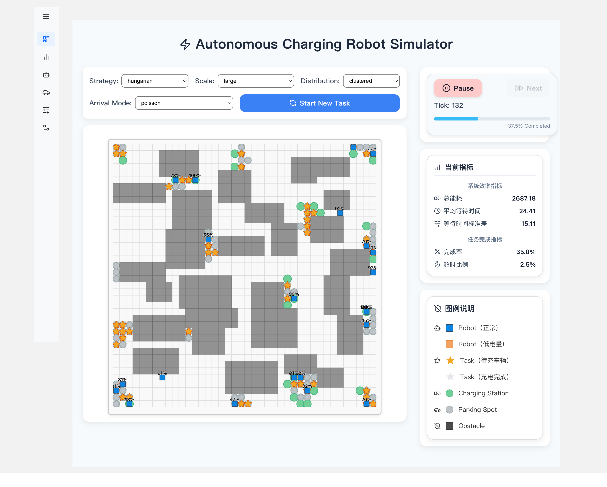
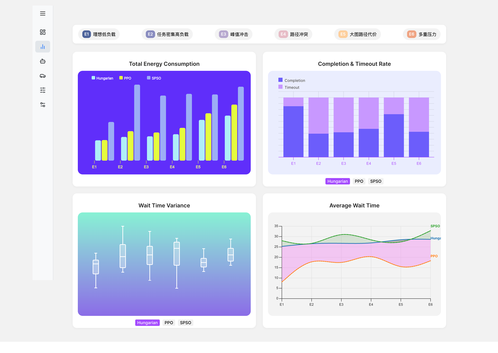
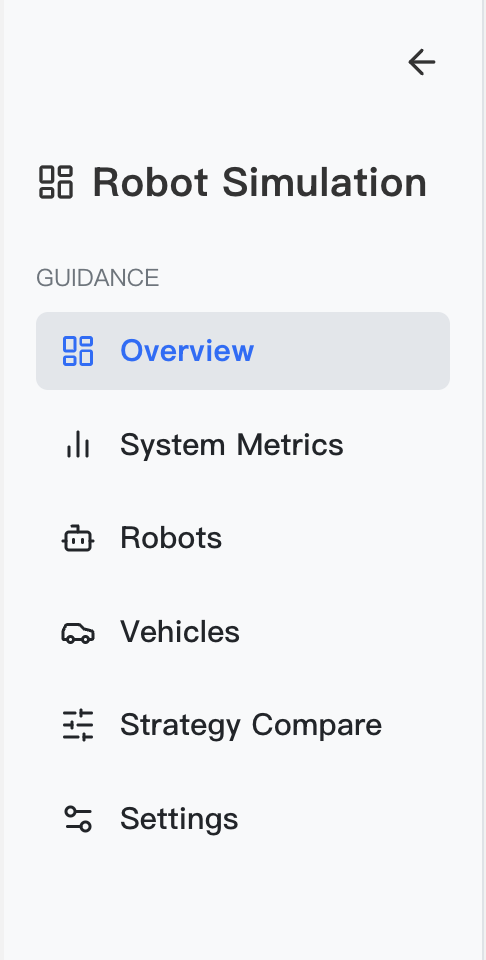

# ⚡ Charging-Simulator

A dynamic robot scheduling simulator for electric vehicle charging in smart campus or industrial parks. This project supports multiple dispatching strategies, visual simulation, and performance analytics.


## 🚀 Project Overview

This system simulates autonomous charging robots that dynamically navigate and serve electric vehicles based on real-time task generation, battery constraints, and strategy logic.

- **Frontend**: React + Vite (JavaScript + TypeScript)
- **Backend**: Flask (Python)
- **Visualization**: SVG + visx (Bar, Threshold, Box, Violin)
- **Simulation**: Discrete-time tick-based system

## 🧠 Core Features

- Dynamic task generation and dispatching
- Supports multiple strategies: Hungarian, PPO, SPSO
- Real-time map rendering with robots, tasks, and chargers
- 2D grid environment with scalable map sizes (small, medium, large)
- Performance metrics: energy used, wait time, completion rate, etc.
- Responsive UI with detailed visual comparison

## 📂 Project Structure

```
charging-simulator/
│
├── Backend/ # Flask Backend
│ ├── app.py # API routes (init_map, next_step, get_state, metrics_summary)
│ ├── environment.py # Simulation environment
│ ├── hungarian.py # Hungarian algorithm
│ ├── ppo_custom.py # PPO agent wrapper
│ ├── spso_algorithm.py # SPSO metaheuristic scheduler
│ ├── train_ppp.py # PPO training interface
│ └── ppo——model/ 
│
├── Frontend/ # React + Vite Frontend
│ ├── src/
│ │ ├── components/ # Boxplot, Barchart, Violin, MapView, etc.
│ │ ├── pages/ # Overview.jsx, Metrics.jsx
│ │ ├── styles/ # Custom CSS files
│ │ ├── App.jsx # Application entry
│ │ └── main.jsx # ReactDOM root
│ └── node_modules/ 
│
├── .venv/
│
├── docs/
│ ├── FinalReport
│ ├── PRE
│ └── showvideo
│
└── README.md
```

## 📡 API Endpoints

| Method | Endpoint             | Description                                |
|--------|----------------------|--------------------------------------------|
| GET    | /api/init_map        | Initialize map and state                   |
| GET    | /api/next_step       | Advance one tick                           |
| GET    | /api/get_state       | Get current state snapshot                 |
| GET    | /api/metrics_summary | Retrieve aggregated performance results    |

## 📊 Metrics Dashboard (`/metrics`)

- 🔋 Total Energy Consumption (BarChart)
- 📉 Average Wait Time (LineChart)
- 📏 Wait Time Variance (Boxplot + ViolinPlot)
- ✅ Completion & Timeout Rate (Stacked Bar)

## 🗺 Scenario Parameters

Each experiment is defined by a 4-tuple:

- `strategy`: hungarian / ppo / spso
- `scale`: small / medium / large
- `distribution`: uniform / cluster / hybrid
- `arrival`: poisson / normal

> The simulator combines these to generate scenarios like `ppo_medium_uniform_poisson`.

## Run Instructions

### 1. Start Backend

```bash
cd backend
pip install -r requirements.txt
python app.py
```

### 2. Start Frontend

```bash
cd charging-frontend
npm install
npm run dev
```

Then open `http://localhost:5173`.

## 📷 Preview





## 📄 License

MIT License © 2025
